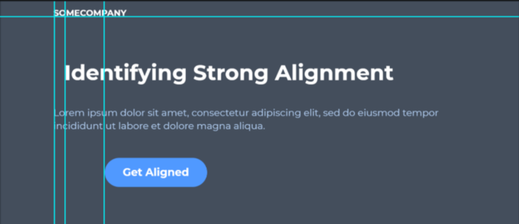

# Alignment

Alignment in UI design in the process of ensuring that every element is positioned correctly in relation to other elements.

Each element in the UI defines a series of rows and columns.

-------------------------------------------------------------

## Old Design

## New Design

