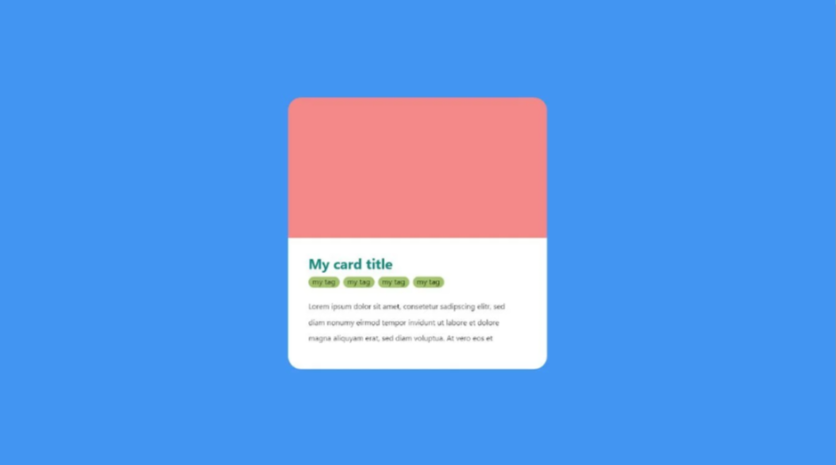
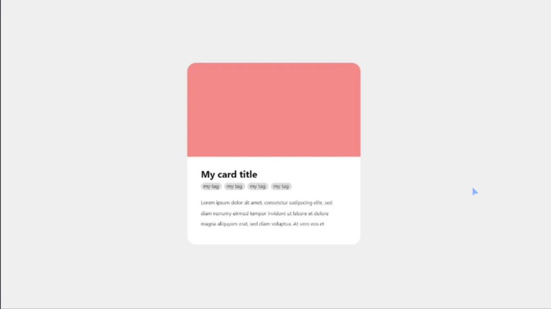
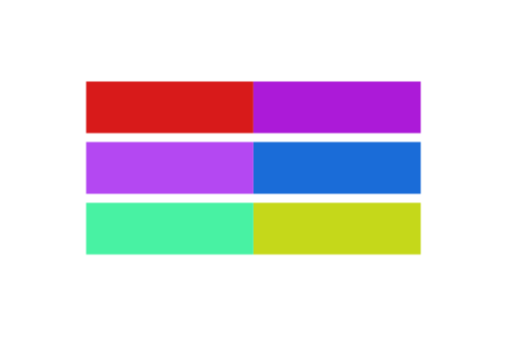
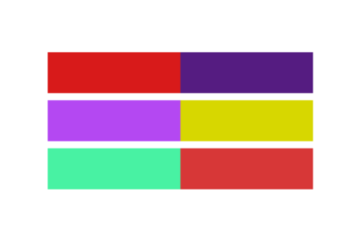
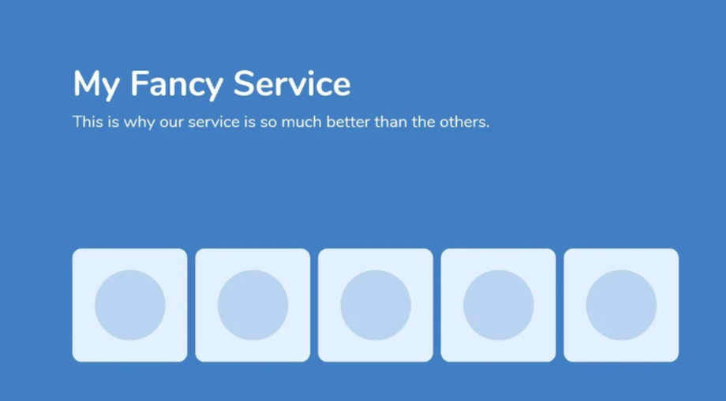
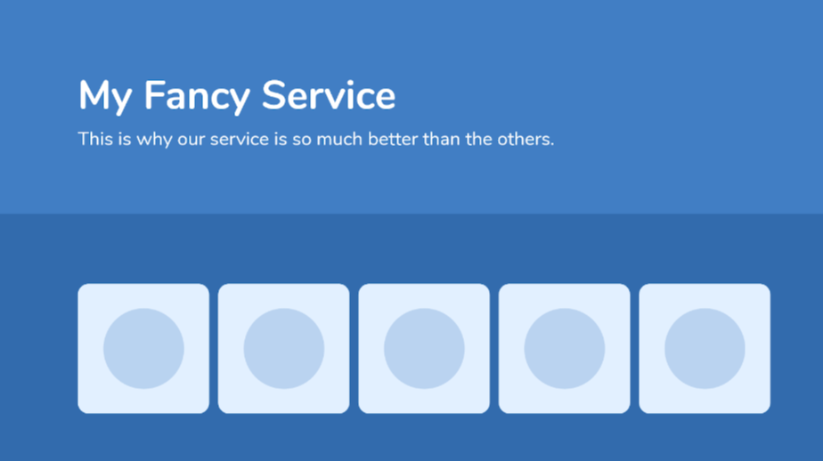
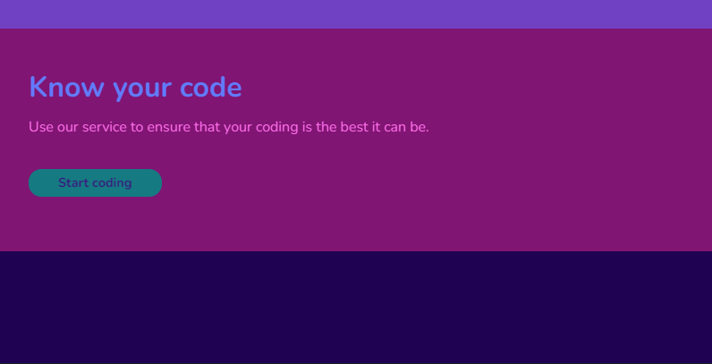
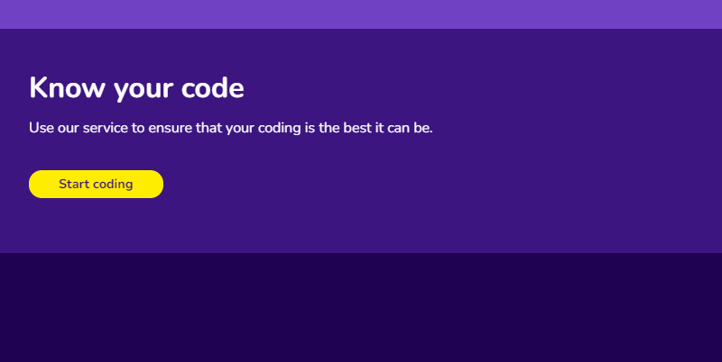

# Color

The first UI design fundamental that shapes a user's experience is color.

## Important Notes

- Green
  - wealth, nature, growth
- Black
  - luxury, sophistication, elegance
- Certain colors can mean different thing to different cultures
- Know your target audience and where they come form before deciding on the color
- What your business wants to project in terms of illiciting emotions

- Do not use too many colors
- Bad Example:
  
- Good Example:
  

- Do not use colors which do not contrast well together
- Bad Example:
  
- Good Example:
  

- Use the same color different hues to create distinction between differents parts of web page
- Bad Example
  
- Good Example:
  

## Old Desing

## New Design

