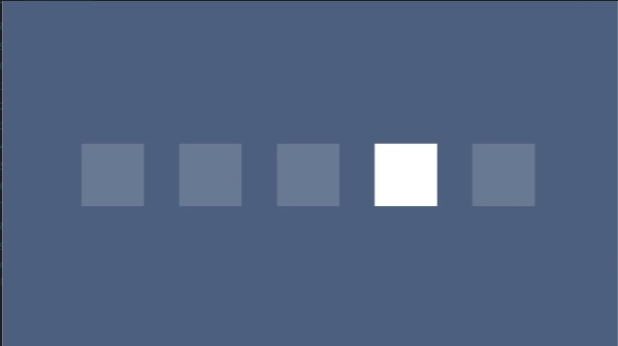
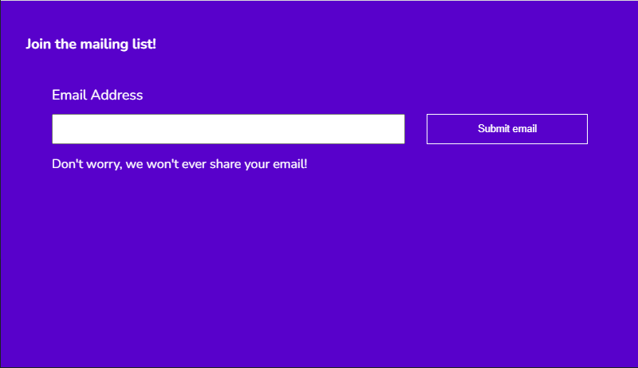

# Visual Hierarchy

Every element on a user interface has a level of importance. Some elements are more important than others. Visual hierarchy is how we establish this importance.

## Example 1

- Bad example
  

- Good example using Alignment\
   

  - Good example using Contrast
    

- Good example using color
  

- Good example using scale
  

- Good example using scale and color
  

## Old Design

- Call to action button does not stick out
- User dont know where to focus

## New Design

- h1 element is the main element as it tells the user what is happening
- we enhance the form area to bring the focus of user there
- email address is more important the label below it
- single call to action button should stand out in the UI design
